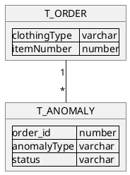

## Contexte and Modèle

Nous sommes une entreprise qui vend des vêtements.

Nous recevons d'un traitement des commandes de vêtements, mais celles-ci peuvent avoir des anomalies.

La personne faisant l'exercice s'occupe du backend applicatif (springboot).

On considère que les données et les actions doivent pouvoir être accessibles ou lancées depuis un front-end indépendant via des endpoints REST.

## Features demandées

Afin de pouvoir demander à des utilisateurs de vérifier l'état des commandes problématiques, nous souhaitons :

- pouvoir ressortir les commandes ayant au moins une anomalie.
- pouvoir annuler une anomalie d'une commande.